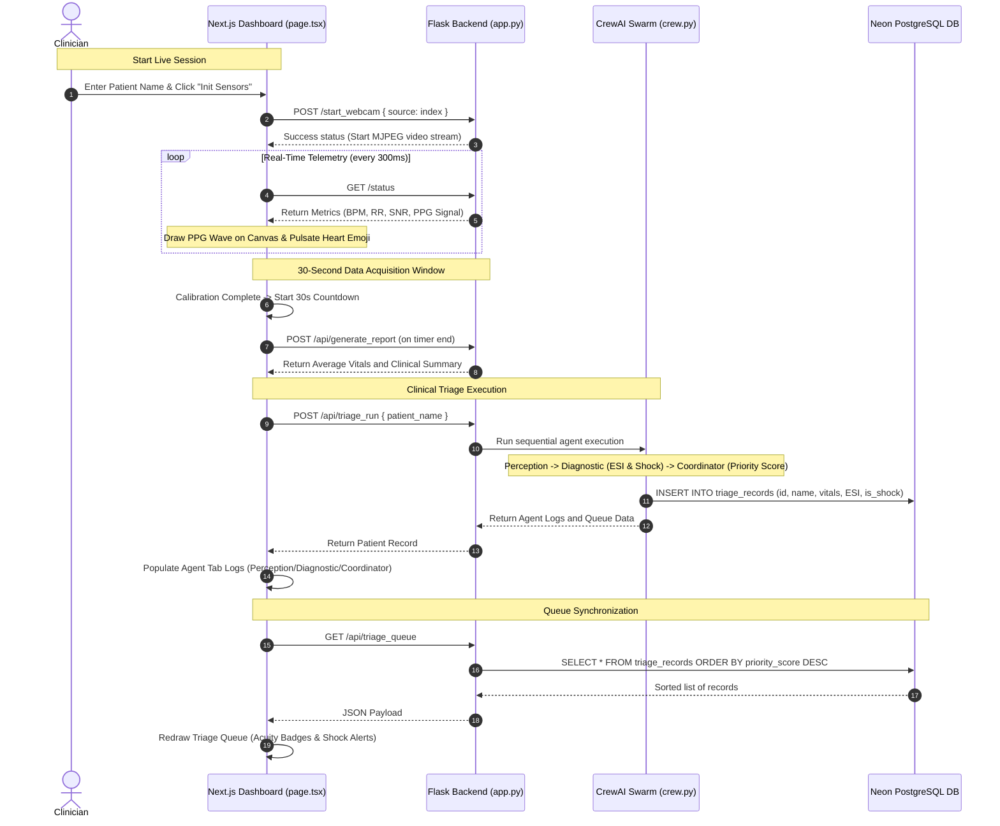

# VITAL Frontend Deep-Dive: Architecture, Features, and Code Walkthrough

This document provides an in-depth, line-by-line and feature-by-feature analysis of the **VITAL Next.js Frontend Dashboard** to ensure complete alignment and understanding of the frontend client architecture.

---

## 🛠️ Technology Stack & Dependencies

The VITAL frontend is built as a single-page web dashboard using the following framework stack:

1. **Next.js 16.2.9 (App Router)**: Utilizing modern layouts (`layout.tsx`) and client-side page rendering (`'use client'` at the top of `page.tsx`).
2. **React 19.2.4 & React-DOM**: Using React Hooks (`useState`, `useEffect`, `useRef`) for DOM references and real-time state updates.
3. **Tailwind CSS v4**: Declared in [globals.css](file:///e:/BMSIT/Major%20project%20-%20internship/Vision-Based-Intelligent-Triage-and-Autonomous-Lifesign-Analytics/frontend/src/app/globals.css) via `@import "tailwindcss";` and utilizing new `@theme` configuration directives.
4. **TypeScript**: Provides static typing and contracts for state management and API requests (e.g. interfaces for `ChatMessage`, `PatientRecord`, `Metrics`, `CameraDevice`).
5. **Web Standard APIs**:
   * **HTML5 Canvas API**: Used to draw the live, high-performance PPG photonic wave signal.
   * **Web Speech API (`SpeechRecognition`)**: Used to convert speech to text (STT) for hands-free clinical commands.
   * **Web Speech Synthesis API (`SpeechSynthesisUtterance`)**: Converts AI responses to clinical read-aloud playback (TTS).

---

## 📂 File & Directory Structure

The frontend consists of the following structure:

```
frontend/
├── package.json              # Next.js, React, and Tailwind dependencies
├── tsconfig.json              # TypeScript compiler configurations
├── postcss.config.mjs        # PostCSS configurations for CSS transformation
├── Dockerfile                # Multi-stage Docker build config for deployment
├── public/                   # Asset storage (e.g., logo, SVG indicators)
│   ├── vital_logo.png
│   └── file.svg/globe.svg/...
└── src/
    └── app/
        ├── favicon.ico
        ├── globals.css       # Core Tailwind styling & default variable themes
        ├── layout.tsx        # HTML wrapper layout and metadata definition
        └── page.tsx          # Main Dashboard logic, UI views, and state (1,664 lines)
```

---

## 🌐 API Integrations & Contracts (Flask Backend Linkages)

The frontend communicates with a Python/Flask backend running locally on `http://127.0.0.1:5002`. The API contracts mapped within [page.tsx](file:///e:/BMSIT/Major%20project%20-%20internship/Vision-Based-Intelligent-Triage-and-Autonomous-Lifesign-Analytics/frontend/src/app/page.tsx) are:

| Method | Endpoint | Description | Payload / Query |
| :--- | :--- | :--- | :--- |
| **GET** | `/api/cameras` | Retrieves connected video devices | `cameras` list, `default` device index |
| **GET** | `/status` | Real-time telemetry feed (polled every 300ms) | Returns metrics JSON: `bpm`, `rr`, `hrv`, `stress_index`, `ppg_signal`, etc. |
| **POST** | `/start_webcam` | Binds the backend to the selected camera index | `{ "source": cameraIndex }` |
| **POST** | `/release_camera`| Stops camera capture and frees optical hardware | None |
| **POST** | `/upload` | Submits local patient files (video/image) | `multipart/form-data` with key `video` |
| **POST** | `/api/generate_report` | Requests clinical session report summaries | None (reads latest active backend buffer) |
| **POST** | `/api/triage_run` | Kicks off the 3-Agent clinical crew swarm | `{ "source": "live", "patient_name": "..." }` or form-data with `patient_name` |
| **GET** | `/api/triage_queue`| Fetches Neon-persisted clinical records | JSON list representing the prioritized patient queue |
| **DELETE**| `/api/triage_queue`| Clears all database triage history records | None |
| **POST** | `/api/chat` | Queries the NVIDIA NIM Llama 3.3 chatbot | `{ "message": "...", "history": [...], "image": "base64" }` |
| **GET** | `/video_feed` | MJPEG video stream source path | Video source query parameterized by a cache-busting timestamp key |
| **GET** | `/image_feed` | JPEG stream target snap for image uploads | Image source path |

---

## 📺 View Breakdown & Interface Layout

The dashboard is structured around a top-level tab-based interface state (`activeTab` state):

### 1. Vitals Monitor (`activeTab === 'monitor'`)
Designed as a real-time clinical dashboard split into two main sections:
* **Left Section (Sensor Intake Feed & Telemetry Diagnostics)**:
  * **Video Feed Display**: Renders the `/video_feed` or `/image_feed` live from Flask. Integrates automatic reconnection handlers using a `videoFeedKey` retry loop to prevent frozen streams.
  * **Interactive Controls**: Text input for the patient name, device selection dropdown, and action buttons (`Init Sensors` / `Play-Pause` toggle / `File Uploader` box).
  * **Diagnostics Board**: Real-time display of camera state (FPS), Face ROI Lock detection indicator, ambient luminance (optimal if > 100 LUX), signal stability %, and signal-to-noise ratio (SNR) in decibels.
* **Right Section (Physiological Indicators & PPG Plot)**:
  * **Circular Progress Timer**: Tracks the 30-second session window once sensors are calibrated.
  * **Vitals Grid**: Displays **Heart Rate (BPM)** with a custom pulse animation synched directly to the patient's heart rate frequency, **Respiratory Rate (B/min)**, and **Stress Index** (Baevsky Index).
  * **Warning Board**: Renders critical warnings if ambient conditions or body positions degrade signal quality (e.g. motion limits exceeded).
  * **Welch-Spline rPPG Photonic Waveform**: Real-time signal graphing on an HTML5 canvas, mapping the `ppg_signal` array (buffered from the backend) with smooth line scaling and neon-cyan glow filters.
  * **30-Second Clinical Report Box**: Displays average BPM, HRV (RMSSD in ms), stress rating levels, and a clinical summary narrative upon completion.

### 2. Triage Dispatch (`activeTab === 'queue'`)
* Displays patient history entries retrieved from the Neon PostgreSQL database.
* Items are sorted dynamically by severity based on the assigned priority score.
* Renders **ESI Levels (1 to 5)** with standard color-coded badges (Red for critical Level 1, Green/Cyan for Level 4/5).
* Renders a glowing red **Compensated Shock Alert** if the backend flags `is_shock = true` (indicating physiological instability like high heart rate paired with tachypnea).
* Provides a **Flush Queue** button to clear records.

### 3. Clinical Crew (`activeTab === 'crew'`)
Exposes detailed output logs showing the execution of the CrewAI 3-Agent swarm:
* **Perception Agent Tab**: Displays logging metrics regarding vitals extraction and signal SNR.
* **Diagnostic Agent Tab**: Details ESI level calculations, shock index parameters, and the raw markdown execution traces.
* **Coordinator Agent Tab**: Displays priority ratings, primary diagnosis metrics, and queue scheduling summaries.

### 4. ARIA Assistant (`activeTab === 'chat'`)
* Multimodal AI chatbot panel allowing OCR document analysis, text chat, and speech features.
* Renders the conversation history between the clinician and ARIA.
* Includes file attachment listeners (`📎 Attach`) for processing lab reports or patient chart images.
* Integrates `🎙️ Speak` voice input using Web Speech API STT and reads out replies using TTS.

---

## ⚡ UX Systems & Advanced UI Features

### 🟢 Real-Time Status & Connection Polling
1. On component mount, `checkBackendStatus` runs a GET request to `/api/cameras` to verify if the server is alive.
2. If online, `backendOnline` is set to `true`, and the header badge glows green (`ONLINE`).
3. An active background loop runs a telemetry polling fetch on `/status` every **300ms** to update metrics and feed the PPG canvas. If the backend drops, the dashboard pauses active loops and turns gray/red (`OFFLINE`).

### 🌊 HTML5 Canvas PPG Photonic Waveform
The canvas renders the raw PPG signal in real-time:
* Clears previous drawings and overlays a grid structure.
* Traces `ppg_signal` data, computing local min/max values to automatically normalize amplitude fluctuations.
* Uses canvas gradient fills (`ctx.createLinearGradient`) to paint a smooth semi-transparent cyan field under the curve.
* Draws a high-contrast neon-cyan stroke line with shadow blur properties (`ctx.shadowBlur = 12`) to mimic professional hospital patient monitors.

### 🌓 Theme Switcher (Dark / Light CSS Injection)
Instead of importing large utility libraries, theme-switching is managed via a dynamically-rendered CSS block in `page.tsx`:
* Toggled by a button in the header.
* Injects a `<style jsx global>` tag targeting class `.light-theme`.
* Overrides CSS variables (`--background`, `--foreground`) and changes text colors (`text-zinc-100` -> dark slate), container backgrounds (`bg-[#090e1e]/60` -> slate paper), and borders, ensuring a crisp, high-contrast light layout while maintaining a neon aesthetic for dark mode.

---

## 🚀 Step-by-Step Code Flow Walkthrough

The following flowchart details how user inputs are captured, analyzed, and persisted:



---

### Key Points of Flow Control in `page.tsx`:

1. **Reconnection Mechanism (Line 818-825)**:
   * The `` handles stream resets by tracking a `videoFeedKey` state.
   * If the stream encounters a network hiccup or is reset, the image's `onError` callback fires.
   * This schedules a `setTimeout` to increment `videoFeedKey` by `1` after `1` second.
   * The key update shifts the source path (e.g. `/video_feed?t=1` to `/video_feed?t=2`), forcing the browser to execute a fresh request to the backend stream.

2. **Session Reporting Loop (Line 185-227)**:
   * A React effect watches the `metrics.calibration_done` and `metrics.is_live` flags.
   * If both are true, it initiates a 1-second interval timer decreasing `sessionTimer` from `30` to `0`.
   * When `sessionTimer` hits `0`, it triggers `fetch('/api/generate_report', { method: 'POST' })` to grab the overall summary.
   * The response triggers `handleRunTriage(patientName)` automatically, kicking off the CrewAI swarm without requiring the clinician to click manual submit buttons.

3. **ARIA OCR Processing (Line 1593-1655)**:
   * When an image is loaded, it is transformed into a Base64 string via a `FileReader` (`handleImageAttachment`).
   * When the clinician sends a chat query, the payload is sent as JSON containing:
     * `{ message: chatInput, history: [...], image: selectedImage }`
   * This provides the backend multimodal NIM LLM with clean image contexts alongside raw text queries.
